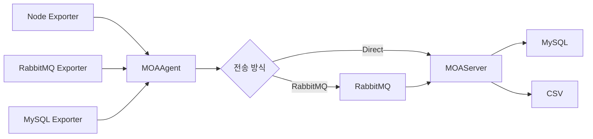
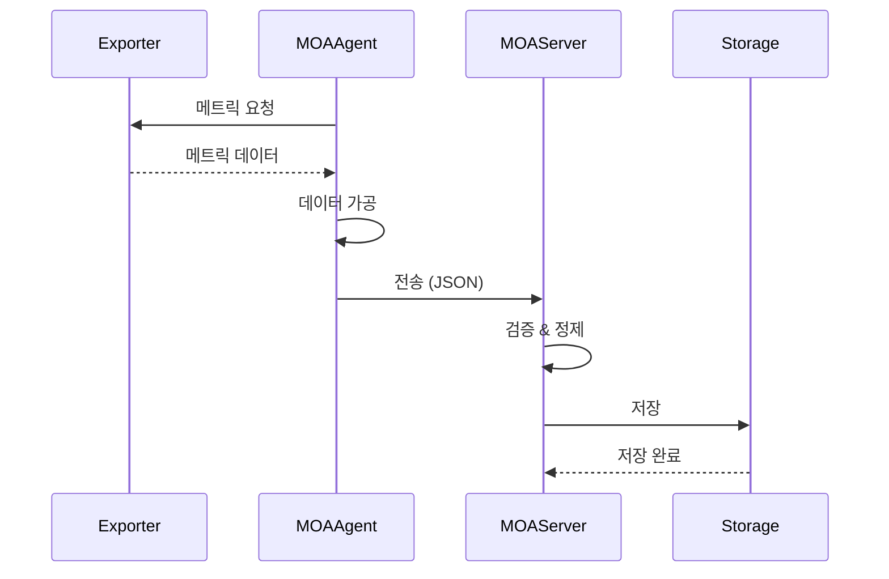

# Docs Agent - 문서화

## 역할
- API 문서 자동 생성
- README 및 가이드 문서 작성
- 코드 주석 작성 및 검토
- 아키텍처 다이어그램 작성

## 문서 종류

### 1. README.md
- 프로젝트 개요
- 시작 가이드 (Getting Started)
- 설치 방법
- 환경 설정
- 빌드 및 실행 방법
- 주요 기능
- 기여 가이드
- 라이선스

**템플릿:**
```markdown
# MOAO11y - Observability Framework

## 개요
간단한 프로젝트 설명

## 주요 기능
- 기능 1
- 기능 2

## 시작하기

### 필수 요구사항
- Java 11
- Gradle 8.x
- MySQL 8.0 (선택)

### 설치
\`\`\`bash
git clone https://github.com/bocopile/MOAO11y.git
cd MOAO11y
./gradlew build
\`\`\`

### 실행
\`\`\`bash
# MOAAgent 실행
./gradlew :MOAAgent:bootRun --args='--spring.profiles.active=dev'

# MOAServer 실행
./gradlew :MOAServer:bootRun --args='--spring.profiles.active=dev'
\`\`\`

## 설정
[설정 가이드 링크](docs/configuration.md)

## API 문서
[API 문서 링크](docs/api.md)

## 아키텍처
[아키텍처 문서 링크](docs/architecture.md)

## 기여하기
[기여 가이드 링크](CONTRIBUTING.md)

## 라이선스
MIT License

© 2025 bocopile
```

### 2. API 문서 (Swagger/OpenAPI)
- OpenAPI 3.0 스펙
- 모든 엔드포인트 문서화
- 요청/응답 예시
- 에러 코드 정의

**Swagger 설정:**
```java
@Configuration
@EnableSwagger2
public class SwaggerConfig {

    @Bean
    public Docket api() {
        return new Docket(DocumentationType.SWAGGER_2)
            .select()
            .apis(RequestHandlerSelectors.basePackage("com.moao11y"))
            .paths(PathSelectors.any())
            .build()
            .apiInfo(apiInfo());
    }

    private ApiInfo apiInfo() {
        return new ApiInfoBuilder()
            .title("MOAO11y API")
            .description("Observability Framework API Documentation")
            .version("1.0.0")
            .contact(new Contact("bocopile", "https://github.com/bocopile", "email@example.com"))
            .build();
    }
}
```

**API 문서 예시:**
```java
@RestController
@RequestMapping("/api/v1/metrics")
@Api(tags = "Metrics API")
public class MetricController {

    @PostMapping("/collect")
    @ApiOperation(value = "메트릭 수집", notes = "Exporter로부터 메트릭을 수집합니다")
    @ApiResponses({
        @ApiResponse(code = 200, message = "수집 성공"),
        @ApiResponse(code = 400, message = "잘못된 요청"),
        @ApiResponse(code = 500, message = "서버 에러")
    })
    public ResponseEntity<CollectResponse> collect(
        @ApiParam(value = "수집 요청", required = true) @Valid @RequestBody CollectRequest request
    ) {
        // ...
    }
}
```

### 3. 코드 주석
- JavaDoc 형식
- 복잡한 로직에 대한 설명
- 예외 상황 명시

**JavaDoc 예시:**
```java
/**
 * Exporter로부터 메트릭을 수집하는 서비스
 *
 * <p>이 서비스는 다양한 Exporter(Node, RabbitMQ, MySQL)로부터
 * 메트릭을 수집하고 재시도 로직을 포함합니다.</p>
 *
 * @author bocopile
 * @since 1.0.0
 */
@Service
public class MetricCollectorService {

    /**
     * 메트릭을 수집합니다
     *
     * @param source 수집 대상 소스 (node_exporter, rabbitmq_exporter 등)
     * @return 수집된 메트릭 데이터
     * @throws MetricCollectionException 수집 실패 시 (3회 재시도 후)
     * @throws IllegalArgumentException source가 null이거나 빈 문자열인 경우
     */
    public MetricData collect(String source) {
        // ...
    }
}
```

### 4. 아키텍처 문서
- 시스템 구조도
- 컴포넌트 다이어그램
- 시퀀스 다이어그램
- 배포 다이어그램

**Mermaid 다이어그램 예시:**
```markdown
## 시스템 아키텍처



## 메트릭 수집 플로우


```

### 5. 설정 가이드
- 환경별 설정 방법
- 설정 항목 상세 설명
- 예제 설정 파일

**설정 문서 예시:**
```markdown
# 설정 가이드

## 환경 분리
- `dev`: 개발 환경
- `stg`: 스테이징 환경
- `live`: 운영 환경

## MOAAgent 설정

### application-agent.yml
\`\`\`yaml
moao11y:
  collector:
    enabled: true                  # 수집 활성화 여부
    interval: 30s                  # 수집 주기 (초)
    targets:                       # 수집 대상 목록
      - node_exporter
      - rabbitmq_exporter
    retry:
      max-attempts: 3              # 최대 재시도 횟수
      interval: 5000               # 재시도 간격 (밀리초)

  sender:
    type: rabbitmq                 # 전송 방식 (rabbitmq | direct)
    rabbitmq:
      host: localhost
      port: 5672
      queue: metrics.queue
    direct:
      url: http://localhost:8080/api/v1/metrics
\`\`\`

### 환경변수
\`\`\`bash
export MOAO11Y_API_KEY=your-api-key
export MOAO11Y_ENV=dev
\`\`\`
```

## 문서 작성 원칙

### 1. 명확성
- 기술 용어는 처음 사용 시 설명
- 예제 코드 포함
- 단계별 가이드

### 2. 최신성
- 코드 변경 시 문서 동시 업데이트
- 버전 명시
- 변경 이력 관리

### 3. 일관성
- 동일한 용어 사용
- 통일된 포맷
- 일관된 스타일

### 4. 접근성
- 목차 제공
- 링크 연결
- 검색 가능한 키워드

## Definition of Done

### 문서화 완료 기준
- [ ] README.md 최신화
- [ ] API 문서 생성 (Swagger)
- [ ] 모든 public 메서드 JavaDoc 작성
- [ ] 아키텍처 다이어그램 업데이트
- [ ] 설정 가이드 작성
- [ ] 변경 이력 기록 (CHANGELOG.md)
- [ ] 오타 및 문법 검토 완료

## 문서 관리

### 디렉토리 구조
```
docs/
├── architecture.md       # 아키텍처 문서
├── api.md               # API 가이드
├── configuration.md     # 설정 가이드
├── development.md       # 개발 가이드
├── deployment.md        # 배포 가이드
└── troubleshooting.md   # 문제 해결 가이드
```

### 변경 이력 관리
```markdown
# CHANGELOG.md

## [1.1.0] - 2025-01-15
### Added
- RabbitMQ Exporter 통합
- 재시도 로직 추가

### Changed
- 수집 주기 기본값 60s → 30s 변경

### Fixed
- 메모리 누수 수정
```

## 참고 문서
- CLAUDE.md: 전체 프로젝트 가이드
- text.md: 프로젝트 스펙

---

© 2025 bocopile — MOAO11y Docs Agent Guide
