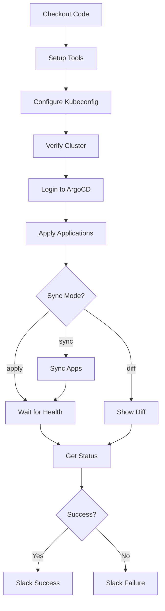
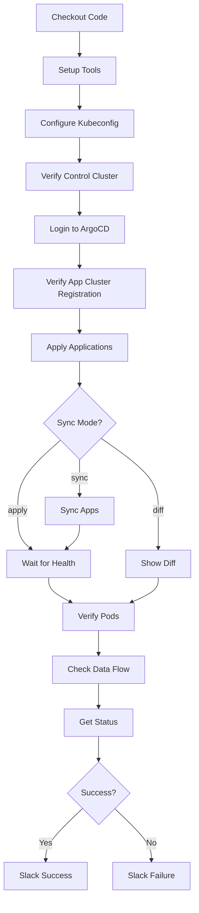

# CI/CD Pipeline with GitHub Actions

## Overview

이 프로젝트는 GitHub Actions를 사용하여 Multi-cluster Kubernetes 환경에 자동으로 애드온을 배포합니다. ArgoCD GitOps 패턴과 통합되어 선언적이고 추적 가능한 배포를 제공합니다.

## 📋 Workflows

### 1. `deploy-control.yml` - Control Cluster 배포

**트리거 조건**:
- `main` 또는 `stage` 브랜치에 push
- 다음 경로의 파일 변경:
  - `argocd-apps/control-cluster/**`
  - `addons/values/monitoring/**`
  - `addons/values/logging/**`
  - `addons/values/tracing/**`
  - `addons/values/vault/**`
  - `addons/values/service-mesh/**`
- 수동 실행 (workflow_dispatch)

**배포 항목**:
- ✅ Loki (중앙 로깅)
- ✅ Tempo (중앙 트레이싱)
- ✅ Vault (시크릿 관리)
- ✅ Istio Control Plane (Service Mesh)

**실행 시간**: 약 10-15분

---

### 2. `deploy-app.yml` - App Cluster 배포

**트리거 조건**:
- `main` 또는 `stage` 브랜치에 push
- 다음 경로의 파일 변경:
  - `argocd-apps/app-cluster/**`
  - `addons/values/logging/app-**`
  - `addons/values/tracing/app-**`
  - `addons/values/monitoring/app-**`
  - `addons/values/vault/app-**`
  - `addons/values/service-mesh/app-**`
  - `addons/values/workload/**`
- 수동 실행 (workflow_dispatch)

**배포 항목**:
- ✅ Fluent-Bit (로그 수집)
- ✅ OpenTelemetry Collector (트레이스 수집)
- ✅ Prometheus Agent (메트릭 수집)
- ✅ Vault Agent (시크릿 주입)
- ✅ Istio Data Plane (Service Mesh)
- ✅ KEDA (오토스케일링)
- ✅ Kyverno (정책 엔진)

**실행 시간**: 약 10-15분

---

## 🔧 Setup

### Prerequisites

1. **GitHub Repository Secrets 설정**
2. **Slack Webhook URL 설정**
3. **ArgoCD 인증 토큰 발급**

### 1. GitHub Secrets 설정

GitHub Repository → Settings → Secrets and variables → Actions → New repository secret

필수 Secrets:

| Secret Name | Description | Example |
|-------------|-------------|---------|
| `KUBECONFIG_CONTROL` | Control Cluster kubeconfig (base64 encoded) | `cat ~/.kube/control-cluster \| base64` |
| `KUBECONFIG_APP` | App Cluster kubeconfig (base64 encoded) | `cat ~/.kube/app-cluster \| base64` |
| `ARGOCD_SERVER` | ArgoCD server address | `argocd.bocopile.io` |
| `ARGOCD_AUTH_TOKEN` | ArgoCD authentication token | `argocd account generate-token` |
| `SLACK_WEBHOOK_URL` | Slack Incoming Webhook URL | `https://hooks.slack.com/services/...` |

### 2. Kubeconfig Secrets 생성

#### Control Cluster Kubeconfig

```bash
# Kubeconfig를 base64 인코딩
cat ~/.kube/config | grep -A 20 "control-cluster" | base64

# 또는 전체 config 사용
cat ~/.kube/config | base64
```

GitHub Secrets에 `KUBECONFIG_CONTROL`로 저장

#### App Cluster Kubeconfig

```bash
# Kubeconfig를 base64 인코딩
cat ~/.kube/config | grep -A 20 "app-cluster" | base64

# 또는 전체 config 사용
cat ~/.kube/config | base64
```

GitHub Secrets에 `KUBECONFIG_APP`로 저장

### 3. ArgoCD Authentication Token 발급

```bash
# ArgoCD에 로그인
argocd login argocd.bocopile.io

# 영구 토큰 생성 (계정: admin)
argocd account generate-token --account admin

# 출력된 토큰을 복사하여 ARGOCD_AUTH_TOKEN으로 저장
```

**주의**: 토큰은 한 번만 표시되므로 안전하게 보관

### 4. Slack Webhook URL 생성

#### 4.1. Slack App 생성

1. https://api.slack.com/apps 접속
2. "Create New App" 클릭
3. "From scratch" 선택
4. App Name: `Terraform K8s Notifications`
5. Workspace 선택

#### 4.2. Incoming Webhooks 활성화

1. 좌측 메뉴 "Incoming Webhooks" 클릭
2. "Activate Incoming Webhooks" 토글 ON
3. "Add New Webhook to Workspace" 클릭
4. 알림을 받을 채널 선택 (예: `#개발`)
5. "Allow" 클릭

#### 4.3. Webhook URL 복사

```
https://hooks.slack.com/services/T00000000/B00000000/XXXXXXXXXXXXXXXXXXXX
```

GitHub Secrets에 `SLACK_WEBHOOK_URL`로 저장

---

## 🚀 Usage

### Automatic Deployment (Push-based)

```bash
# 1. 파일 수정
vim argocd-apps/control-cluster/loki.yaml

# 2. Git commit & push
git add argocd-apps/control-cluster/loki.yaml
git commit -m "Update Loki configuration"
git push origin stage

# 3. GitHub Actions 자동 실행
# - deploy-control.yml workflow가 자동으로 트리거됨
# - ArgoCD가 Loki Application을 동기화
# - 결과를 Slack으로 알림
```

### Manual Deployment (workflow_dispatch)

#### GitHub UI에서 실행

1. GitHub Repository → Actions 탭
2. 원하는 workflow 선택 (Deploy Control Cluster 또는 Deploy App Cluster)
3. "Run workflow" 버튼 클릭
4. 파라미터 선택:
   - **app_name**: 배포할 애플리케이션 (기본값: `all`)
   - **sync_mode**: 동기화 모드 (기본값: `apply`)
     - `apply`: ArgoCD Application 생성/업데이트만
     - `sync`: Application 동기화 수행
     - `diff`: 변경사항만 표시
5. "Run workflow" 클릭

#### GitHub CLI로 실행

```bash
# Install GitHub CLI
brew install gh

# Login
gh auth login

# Control Cluster 배포
gh workflow run deploy-control.yml \
  --ref stage \
  -f app_name=loki \
  -f sync_mode=sync

# App Cluster 배포
gh workflow run deploy-app.yml \
  --ref stage \
  -f app_name=fluent-bit \
  -f sync_mode=sync

# 모든 앱 배포
gh workflow run deploy-control.yml \
  --ref stage \
  -f app_name=all \
  -f sync_mode=sync
```

---

## 📊 Workflow Steps

### Control Cluster Deployment



### App Cluster Deployment



---

## 📧 Slack Notifications

### Success Notification


**포함 정보**:
- ✅ Repository 이름
- ✅ Branch 이름
- ✅ Commit SHA 및 URL
- ✅ Author
- ✅ Application 상태 (Health / Sync)
- ✅ Commit 메시지
- ✅ Workflow Run URL
- ✅ ArgoCD UI URL
- ✅ (App Cluster만) 관찰성 엔드포인트

### Failure Notification


**포함 정보**:
- ❌ Repository 이름
- ❌ Branch 이름
- ❌ Commit SHA 및 URL
- ❌ Author
- ❌ Commit 메시지
- ❌ 에러 메시지
- ❌ Workflow Run URL

---

## 🔍 Monitoring Deployments

### GitHub Actions UI

```
https://github.com/<owner>/<repo>/actions
```

- Workflow 실행 이력 확인
- 로그 상세 조회
- 실패 단계 식별
- Re-run 가능

### ArgoCD UI

```
https://argocd.bocopile.io
```

- Application Health 상태
- Sync Status
- Resource Tree
- Diff 비교
- Manual Sync/Rollback

### Slack Channel

- 실시간 알림
- 성공/실패 즉시 확인
- Quick Access 버튼
- 팀 협업

---

## 🛠 Troubleshooting

### Workflow Fails to Start

#### Issue: Workflow not triggered on push

```bash
# 1. Check if path filters match
git diff --name-only HEAD~1

# 2. Check branch name
git rev-parse --abbrev-ref HEAD

# 3. Manually trigger
gh workflow run deploy-control.yml --ref stage
```

#### Issue: "secrets not found" error

```bash
# Verify secrets are set
gh secret list

# Set missing secrets
gh secret set KUBECONFIG_CONTROL < kubeconfig-control.b64
gh secret set ARGOCD_AUTH_TOKEN
```

### ArgoCD Authentication Fails

#### Issue: "failed to connect to ArgoCD server"

```bash
# 1. Check ArgoCD server is accessible
curl -k https://argocd.bocopile.io

# 2. Verify auth token
argocd account generate-token --account admin

# 3. Update secret
gh secret set ARGOCD_AUTH_TOKEN
```

#### Issue: "permission denied"

```bash
# Create service account with proper permissions
kubectl create sa github-actions -n argocd

# Create token
kubectl create token github-actions -n argocd --duration=87600h

# Grant permissions
kubectl create clusterrolebinding github-actions \
  --clusterrole=argocd-admin \
  --serviceaccount=argocd:github-actions
```

### Application Sync Fails

#### Issue: Application stuck in "OutOfSync"

```bash
# 1. Check application status
argocd app get <app-name>

# 2. View diff
argocd app diff <app-name>

# 3. Manual sync with replace
argocd app sync <app-name> --replace
```

#### Issue: Application unhealthy

```bash
# 1. Get detailed status
kubectl get application <app-name> -n argocd -o yaml

# 2. Check target cluster pods
kubectl get pods -n <namespace>

# 3. Check logs
kubectl logs -n <namespace> <pod-name>

# 4. Describe pod for events
kubectl describe pod -n <namespace> <pod-name>
```

### Slack Notifications Not Received

#### Issue: No Slack messages

```bash
# 1. Verify webhook URL
curl -X POST \
  -H 'Content-type: application/json' \
  --data '{"text":"Test message"}' \
  $SLACK_WEBHOOK_URL

# 2. Check workflow logs for Slack step

# 3. Verify secret
gh secret list | grep SLACK
```

#### Issue: Slack message format broken

- Check JSON payload in workflow file
- Validate against Slack Block Kit Builder: https://app.slack.com/block-kit-builder

---

## 📋 Best Practices

### 1. Branch Strategy

```
main (production)
  ↑
stage (staging)
  ↑
feature/* (development)
```

- `feature/*` → `stage`: 자동 배포 to App Cluster
- `stage` → `main`: Manual approval + 자동 배포 to Control Cluster
- `main`: Production 환경

### 2. Commit Messages

```bash
# Good
git commit -m "[TERRAFORM-71] Update Loki retention to 60 days"

# Bad
git commit -m "update loki"
```

### 3. Rollback Strategy

```bash
# Option 1: Git revert
git revert <commit-sha>
git push origin stage

# Option 2: ArgoCD rollback
argocd app rollback <app-name> <revision>

# Option 3: Manual kubectl apply
kubectl apply -f argocd-apps/control-cluster/loki.yaml
```

### 4. Testing Before Merge

```bash
# 1. Test locally with dry-run
kubectl apply -f argocd-apps/control-cluster/loki.yaml --dry-run=server

# 2. Use diff mode
gh workflow run deploy-control.yml -f sync_mode=diff

# 3. Deploy to stage first
git push origin feature/update-loki
# Review in stage environment
git checkout main
git merge feature/update-loki
git push origin main
```

---

## 🔐 Security Considerations

### Secrets Rotation

```bash
# 1. Generate new ArgoCD token
NEW_TOKEN=$(argocd account generate-token --account admin)

# 2. Update GitHub secret
gh secret set ARGOCD_AUTH_TOKEN <<< "$NEW_TOKEN"

# 3. Test workflow
gh workflow run deploy-control.yml -f sync_mode=diff
```

### Kubeconfig Security

- ✅ Use separate service accounts for CI/CD
- ✅ Rotate credentials regularly (every 90 days)
- ✅ Limit permissions to minimum required
- ✅ Use short-lived tokens when possible
- ❌ Never commit kubeconfig to repository
- ❌ Never share tokens via Slack/Email

### Audit Trail

- GitHub Actions logs (retained for 90 days)
- ArgoCD Application history
- Slack notification archive
- Git commit history

---

## 📚 Related Documentation

- [Installation Scripts](./INSTALLATION_SCRIPTS.md)
- [ArgoCD Multi-cluster Setup](./addons/ARGOCD_MULTI_CLUSTER.md)
- [Multi-cluster Operations](./MULTI_CLUSTER_OPERATIONS.md)
- [Slack Integration](https://api.slack.com/messaging/webhooks)
- [GitHub Actions](https://docs.github.com/en/actions)
- [ArgoCD](https://argo-cd.readthedocs.io/)

---

## 📝 Change Log

| Date | Version | Changes |
|------|---------|---------|
| 2025-11-18 | 1.0.0 | 초기 CI/CD 파이프라인 구축 및 Slack 통합 |
