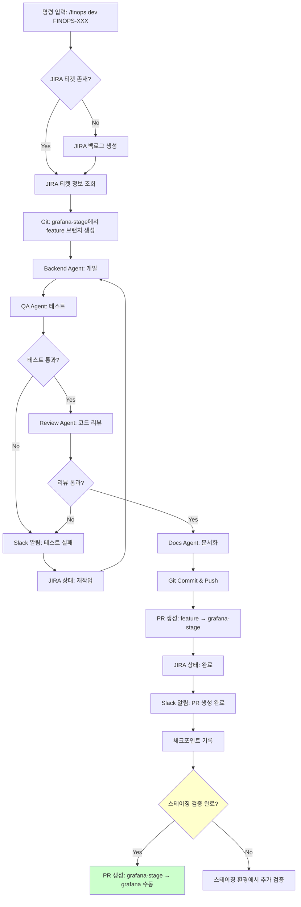

# Claude Code SubAgent Workflow

## 개요
Claude Code SubAgent의 JIRA 티켓 기반 자동화 개발 워크플로우를 정의합니다.
**단일 명령 입력** → **JIRA 연동** → **Git 브랜치 생성** → **개발/테스트** → **PR 생성** → **완료 처리**까지 전체 사이클을 자동화합니다.

---

## 1. 전체 플로우 다이어그램



---

## 2. 세부 단계별 작업

### Phase 1: 준비 단계

#### 1.1 명령 입력
```bash
# 개발 사이클 시작
/terraform dev TERRAFORM-350

# 체크포인트 재개
/terraform resume TERRAFORM-350

# 처음부터 재시작
/terraform restart TERRAFORM-350
```

#### 1.2 JIRA 티켓 확인/생성
```python
# JIRA API 호출
def get_or_create_jira_ticket(ticket_id):
    ticket = jira_client.get_issue(ticket_id)

    if not ticket:
        # 백로그 자동 생성
        ticket = jira_client.create_issue({
            'project': 'TERRAFORM',
            'summary': '자동 생성 백로그',
            'type': 'Task',
            'status': '준비'
        })

    return ticket
```

**JIRA 필드 매핑:**
- `summary`: 작업 제목
- `description`: 작업 상세 설명
- `assignee`: 담당자
- `labels`: 태그 (backend, api, db 등)
- `status`: 진행 상태 (준비 → 진행중 → 테스트 → 완료 → 재작업)

#### 1.3 Git 브랜치 전략
**브랜치 구조:**
```
main (메인 브랜치 - 운영)
  └── stage (스테이징 브랜치)
        └── feature/TERRAFORM-{number} (각 백로그별 작업 브랜치)
```

**브랜치 생성:**
```bash
# 1. stage에서 분기
git checkout stage
git pull origin stage

# 2. JIRA 티켓 번호 기반 브랜치 생성
git checkout -b feature/TERRAFORM-350

# 브랜치 이름 규칙
feature/TERRAFORM-{number}   # 신규 기능
bugfix/TERRAFORM-{number}    # 버그 수정
hotfix/TERRAFORM-{number}    # 긴급 수정
refactor/TERRAFORM-{number}  # 리팩토링
```

**PR 전략:**
```bash
# Step 1: 작업 브랜치 → stage PR
feature/TERRAFORM-350 → stage

# Step 2: 스테이징 검증 완료 후 → main PR (수동)
stage → main
```

---

### Phase 2: 개발 단계

#### 2.1 Backend Agent 작업
**역할:** 백엔드 코드 개발

**실행 흐름:**
1. JIRA 티켓의 `labels` 확인 (backend, api, scheduler 등)
2. 해당 모듈 코드 작성
3. 단위 테스트 작성
4. 빌드 확인

**작업 예시:**
```java
// MFinOps-WebApi/src/main/java/com/mfinops/api/MetricController.java

@RestController
@RequestMapping("/api/v1/metrics")
public class MetricController {

    @PostMapping("/collect")
    public ResponseEntity<CollectResponse> collect(@Valid @RequestBody CollectRequest request) {
        // FINOPS-350: AWS Cost Explorer 메트릭 수집 API 추가
        return ResponseEntity.ok(metricService.collect(request));
    }
}
```

**체크포인트 기록:**
```json
{
  "ticket": "FINOPS-350",
  "phase": "development",
  "status": "completed",
  "timestamp": "2025-01-15T10:30:00Z",
  "files_changed": [
    "MFinOps-WebApi/src/main/java/com/mfinops/api/MetricController.java"
  ]
}
```

---

#### 2.2 QA Agent 작업
**역할:** 테스트 작성 및 실행

**테스트 플로우:**
```bash
# 1. 단위 테스트 실행
./gradlew test

# 2. 통합 테스트 실행
./gradlew integrationTest

# 3. 코드 커버리지 확인
./gradlew jacocoTestReport

# 4. SonarQube 분석
./gradlew sonarqube
```

**품질 게이트 기준:**
- 테스트 통과율: 100%
- 코드 커버리지: > 80%
- SonarQube Quality Gate: Pass
- 보안 취약점: 0개

**실패 시 처리:**
```python
def handle_test_failure(ticket_id, test_results):
    # 1. JIRA 상태 변경: 진행중 → 재작업
    jira_client.update_issue(ticket_id, {'status': '재작업'})

    # 2. Slack 알림
    slack_client.send_message(
        channel='#finops-dev',
        message=f'[{ticket_id}] 테스트 실패 - 재작업 필요\n{test_results}'
    )

    # 3. Backend Agent로 재작업 요청
    redis_client.publish('backend', f'REWORK {ticket_id}')
```

---

#### 2.3 Review Agent 작업
**역할:** 코드 리뷰 및 보안 검증

**리뷰 체크리스트:**
```markdown
### 자동 리뷰
- [ ] SonarQube 이슈 0개
- [ ] Checkstyle 위반 0개
- [ ] SpotBugs 취약점 0개
- [ ] 의존성 보안 검사 통과

### 수동 리뷰
- [ ] SOLID 원칙 준수
- [ ] 적절한 예외 처리
- [ ] SQL Injection 방지
- [ ] 민감 정보 하드코딩 없음
- [ ] 성능 최적화 확인
```

**리뷰 결과 기록:**
```json
{
  "ticket": "FINOPS-350",
  "review": {
    "auto_review": "PASS",
    "security_check": "PASS",
    "performance_check": "PASS",
    "issues": [],
    "suggestions": [
      "MetricController.java:45 - 캐싱 추가 고려"
    ]
  }
}
```

---

#### 2.4 Docs Agent 작업
**역할:** API 문서 및 README 업데이트

**문서화 작업:**
```bash
# 1. Swagger API 문서 생성
# @ApiOperation, @ApiParam 어노테이션 자동 확인

# 2. README.md 업데이트
# 신규 기능 추가 시 "주요 기능" 섹션 업데이트

# 3. CHANGELOG.md 업데이트
## [Unreleased]
### Added
- [FINOPS-350] AWS Cost Explorer 메트릭 수집 API 추가
```

**체크포인트 기록:**
```json
{
  "ticket": "FINOPS-350",
  "phase": "documentation",
  "status": "completed",
  "docs_updated": [
    "README.md",
    "CHANGELOG.md",
    "docs/api.md"
  ]
}
```

---

### Phase 3: 완료 단계

#### 3.1 Git Commit & Push
```bash
# Commit 메시지 규칙
git commit -m "[FINOPS-350] AWS Cost Explorer 메트릭 수집 API 추가

- MetricController에 POST /api/v1/metrics/collect 엔드포인트 추가
- AWS Cost Explorer 연동 서비스 구현
- 단위 테스트 및 통합 테스트 추가
- API 문서화 완료

Resolves: FINOPS-350"

# Push to remote
git push origin feature/FINOPS-350
```

**Commit 메시지 포맷:**
```
[JIRA-ID] 제목 (50자 이내)

상세 설명:
- 변경 사항 1
- 변경 사항 2
- 변경 사항 3

Resolves: JIRA-ID
```

---

#### 3.2 PR 생성
```bash
# GitHub CLI 사용
gh pr create \
  --title "[FINOPS-350] AWS Cost Explorer 메트릭 수집 API 추가" \
  --body "$(cat <<EOF
## 개요
AWS Cost Explorer API를 연동하여 비용 메트릭을 수집하는 기능을 추가했습니다.

## 변경 사항
- POST /api/v1/metrics/collect 엔드포인트 추가
- AWS Cost Explorer 연동 서비스 구현
- 단위 테스트 및 통합 테스트 추가 (커버리지 85%)

## 테스트 결과
- 단위 테스트: ✅ 통과 (32 tests)
- 통합 테스트: ✅ 통과 (8 tests)
- SonarQube: ✅ Quality Gate PASS
- 보안 검사: ✅ 취약점 0개

## JIRA
Resolves: FINOPS-350

## 리뷰어
@backend-team @qa-team
EOF
)" \
  --base grafana-stage \
  --head feature/FINOPS-350
```

**PR 템플릿:**
```markdown
## 개요
간단한 설명

## 변경 사항
- 변경 1
- 변경 2

## 테스트 결과
- [ ] 단위 테스트 통과
- [ ] 통합 테스트 통과
- [ ] SonarQube Quality Gate 통과
- [ ] 보안 검사 통과

## JIRA
Resolves: FINOPS-XXX

## 스크린샷 (선택)
```

**스테이징 → 운영 배포 프로세스:**
```bash
# Step 1: feature → grafana-stage PR (자동)
gh pr create --base grafana-stage --head feature/FINOPS-350

# Step 2: grafana-stage 환경에서 검증
# - 스테이징 서버 배포
# - 통합 테스트 실행
# - QA 팀 검증

# Step 3: 검증 완료 후 grafana-stage → grafana PR (수동)
gh pr create \
  --title "Release: FINOPS-350, FINOPS-351 배포" \
  --body "스테이징 검증 완료된 기능들을 운영 배포합니다" \
  --base grafana \
  --head grafana-stage

# Step 4: 운영 배포
# - grafana PR 머지
# - 운영 서버 자동 배포
# - 모니터링 및 알림
```

---

#### 3.3 JIRA 상태 업데이트
```python
def complete_jira_ticket(ticket_id, pr_url):
    # 1. 상태 변경: 진행중 → 완료
    jira_client.update_issue(ticket_id, {
        'status': '완료',
        'resolution': 'Done',
        'customfield_pr_url': pr_url  # PR URL 기록
    })

    # 2. 코멘트 추가
    jira_client.add_comment(ticket_id, f'''
        개발 완료 및 PR 생성

        PR: {pr_url}
        테스트: 통과 (커버리지 85%)
        리뷰: 자동 리뷰 통과
        문서: README, CHANGELOG, API 문서 업데이트 완료
    ''')
```

---

#### 3.4 Slack 알림
```python
def send_completion_notification(ticket_id, pr_url):
    slack_client.send_message(
        channel='#finops-dev',
        message=f'''
        ✅ [{ticket_id}] 개발 완료

        📋 PR: {pr_url}
        ✅ 테스트: 통과
        ✅ 리뷰: 통과
        ✅ 문서: 업데이트 완료

        @channel 리뷰 부탁드립니다!
        '''
    )
```

---

## 3. 체크포인트 기반 Resume/Restart

### 3.1 체크포인트 구조
```json
{
  "ticket": "FINOPS-350",
  "checkpoints": [
    {
      "phase": "preparation",
      "status": "completed",
      "timestamp": "2025-01-15T10:00:00Z"
    },
    {
      "phase": "development",
      "status": "completed",
      "timestamp": "2025-01-15T10:30:00Z",
      "files_changed": ["MetricController.java"]
    },
    {
      "phase": "testing",
      "status": "failed",
      "timestamp": "2025-01-15T10:45:00Z",
      "error": "Integration test failed"
    }
  ],
  "current_phase": "testing",
  "last_checkpoint": "development"
}
```

### 3.2 Resume (재개)
```python
def resume_workflow(ticket_id):
    # 1. 체크포인트 조회
    checkpoint = get_latest_checkpoint(ticket_id)

    # 2. 마지막 완료된 Phase 다음부터 재개
    next_phase = get_next_phase(checkpoint['last_checkpoint'])

    # 3. SubAgent에 작업 요청
    redis_client.publish(next_phase, f'RESUME {ticket_id}')

    # 예: last_checkpoint='development' → next_phase='testing'
```

### 3.3 Restart (처음부터 재시작)
```python
def restart_workflow(ticket_id):
    # 1. 체크포인트 초기화
    clear_checkpoints(ticket_id)

    # 2. JIRA 상태 변경: 재작업
    jira_client.update_issue(ticket_id, {'status': '준비'})

    # 3. Git 브랜치 리셋 (grafana-stage 기준)
    git.checkout('grafana-stage')
    git.pull('origin', 'grafana-stage')
    git.branch('-D', f'feature/{ticket_id}')  # 기존 브랜치 삭제

    # 4. 처음부터 시작
    start_workflow(ticket_id)
```

---

## 4. 에러 처리 및 알림

### 4.1 에러 발생 시나리오

#### 테스트 실패
```python
if test_result.failed:
    # 1. JIRA 상태: 재작업
    jira_client.update_issue(ticket_id, {'status': '재작업'})

    # 2. Slack 알림
    slack_client.send_message(f'❌ [{ticket_id}] 테스트 실패\n{test_result.errors}')

    # 3. 체크포인트 기록 (실패 상태)
    save_checkpoint(ticket_id, 'testing', 'failed', test_result.errors)

    # 4. Backend Agent로 재작업 요청
    redis_client.publish('backend', f'REWORK {ticket_id}')
```

#### 빌드 실패
```python
if build_result.failed:
    slack_client.send_message(f'❌ [{ticket_id}] 빌드 실패\n{build_result.errors}')
    jira_client.update_issue(ticket_id, {'status': '재작업'})
```

#### 코드 리뷰 실패
```python
if review_result.has_critical_issues:
    slack_client.send_message(f'⚠️ [{ticket_id}] 리뷰 이슈 발견\n{review_result.issues}')
    jira_client.update_issue(ticket_id, {'status': '재작업'})
```

---

### 4.2 Slack 알림 종류

```python
# 1. 테스트 실패
slack.send(f'❌ [{ticket_id}] 테스트 실패 → 재작업')

# 2. PR 생성 완료
slack.send(f'✅ [{ticket_id}] PR 생성 & 완료')

# 3. 리뷰 요청
slack.send(f'🔍 [{ticket_id}] 리뷰 요청\nPR: {pr_url}')

# 4. 긴급 에러
slack.send(f'🚨 [{ticket_id}] 긴급 에러 발생\n{error}')
```

---

## 5. Redis Pub/Sub 메시지 구조

### 5.1 채널 정의
```python
CHANNELS = {
    'scheduler': 'scheduler_agent',
    'webapi': 'webapi_agent',
    'db': 'db_agent',
    'backend': 'backend_agent',
    'qa': 'qa_agent',
    'review': 'review_agent',
    'docs': 'docs_agent',
    'status': 'status_channel'  # SubAgent → Main Agent 상태 보고
}
```

### 5.2 메시지 포맷
```json
{
  "type": "TASK",
  "ticket": "FINOPS-350",
  "action": "RUN | RESUME | RESTART | REWORK",
  "phase": "development | testing | review | documentation",
  "metadata": {
    "branch": "feature/FINOPS-350",
    "assignee": "backend-agent"
  }
}
```

### 5.3 메시지 흐름 예시
```python
# Main Agent → Backend Agent
redis_client.publish('backend', json.dumps({
    'type': 'TASK',
    'ticket': 'FINOPS-350',
    'action': 'RUN',
    'phase': 'development'
}))

# Backend Agent → Main Agent (완료 보고)
redis_client.publish('status', json.dumps({
    'type': 'STATUS',
    'ticket': 'FINOPS-350',
    'agent': 'backend',
    'status': 'completed',
    'files_changed': ['MetricController.java']
}))

# Main Agent → QA Agent (다음 단계)
redis_client.publish('qa', json.dumps({
    'type': 'TASK',
    'ticket': 'FINOPS-350',
    'action': 'RUN',
    'phase': 'testing'
}))
```

---

## 6. SubAgent 구조

### 6.1 SubAgent 공통 구조
```python
class SubAgent:
    def __init__(self, agent_name, channel):
        self.agent_name = agent_name
        self.channel = channel
        self.redis_client = redis.StrictRedis()

    def start(self):
        """Redis 채널 구독 시작"""
        pubsub = self.redis_client.pubsub()
        pubsub.subscribe(self.channel)

        for message in pubsub.listen():
            if message['type'] == 'message':
                self.handle_message(json.loads(message['data']))

    def handle_message(self, message):
        """메시지 처리 및 작업 실행"""
        action = message['action']
        ticket = message['ticket']

        if action == 'RUN':
            result = self.execute(ticket)
        elif action == 'RESUME':
            result = self.resume(ticket)
        elif action == 'RESTART':
            result = self.restart(ticket)
        elif action == 'REWORK':
            result = self.rework(ticket)

        # 상태 보고
        self.report_status(ticket, result)

    def execute(self, ticket):
        """실제 작업 수행 (각 Agent에서 구현)"""
        raise NotImplementedError

    def report_status(self, ticket, result):
        """Main Agent에 상태 보고"""
        self.redis_client.publish('status', json.dumps({
            'agent': self.agent_name,
            'ticket': ticket,
            'status': result['status'],
            'data': result['data']
        }))
```

### 6.2 Backend Agent 예시
```python
class BackendAgent(SubAgent):
    def __init__(self):
        super().__init__('backend', 'backend_agent')

    def execute(self, ticket):
        # 1. JIRA 티켓 정보 조회
        jira_info = jira_client.get_issue(ticket)

        # 2. 코드 개발 (AI 기반)
        code_files = self.generate_code(jira_info)

        # 3. 단위 테스트 작성
        test_files = self.generate_tests(code_files)

        # 4. 빌드 확인
        build_result = self.run_build()

        if build_result.success:
            return {'status': 'completed', 'data': code_files}
        else:
            return {'status': 'failed', 'data': build_result.errors}
```

---

## 7. Main Agent 구조

### 7.1 Main Agent 역할
- 전체 워크플로우 조율
- SubAgent 작업 분배
- 체크포인트 관리
- JIRA 상태 동기화
- Slack 알림 발송

### 7.2 Main Agent 구현
```python
class MainAgent:
    def __init__(self):
        self.redis_client = redis.StrictRedis()
        self.current_workflows = {}  # ticket_id → workflow_state

    def start_workflow(self, ticket_id):
        """워크플로우 시작"""
        # 1. JIRA 티켓 확인/생성
        ticket = self.get_or_create_jira_ticket(ticket_id)

        # 2. Git 브랜치 생성
        self.create_git_branch(ticket_id)

        # 3. 체크포인트 초기화
        self.init_checkpoint(ticket_id)

        # 4. 첫 번째 SubAgent에 작업 요청
        self.dispatch_to_agent('backend', ticket_id, 'RUN')

    def listen_status_channel(self):
        """SubAgent 상태 모니터링"""
        pubsub = self.redis_client.pubsub()
        pubsub.subscribe('status')

        for message in pubsub.listen():
            if message['type'] == 'message':
                self.handle_status_update(json.loads(message['data']))

    def handle_status_update(self, status):
        """SubAgent 상태 업데이트 처리"""
        ticket = status['ticket']
        agent = status['agent']
        result = status['status']

        if result == 'completed':
            # 체크포인트 기록
            self.save_checkpoint(ticket, agent, 'completed')

            # 다음 Agent로 전달
            next_agent = self.get_next_agent(agent)
            if next_agent:
                self.dispatch_to_agent(next_agent, ticket, 'RUN')
            else:
                # 모든 단계 완료 → PR 생성
                self.create_pr(ticket)
                self.complete_workflow(ticket)

        elif result == 'failed':
            # 실패 처리
            self.handle_failure(ticket, agent, status['data'])

    def get_next_agent(self, current_agent):
        """다음 Agent 결정"""
        workflow = ['backend', 'qa', 'review', 'docs']
        current_index = workflow.index(current_agent)

        if current_index < len(workflow) - 1:
            return workflow[current_index + 1]
        else:
            return None
```

---

## 8. 사용 예시

### 8.1 신규 기능 개발
```bash
# 1. 워크플로우 시작
$ /finops dev FINOPS-350

[Main Agent] JIRA 티켓 FINOPS-350 조회...
[Main Agent] Git: grafana-stage에서 feature/FINOPS-350 브랜치 생성...
[Main Agent] Backend Agent에 작업 요청...

[Backend Agent] 코드 개발 중...
[Backend Agent] 완료 → Main Agent에 보고

[Main Agent] QA Agent에 작업 요청...
[QA Agent] 테스트 실행 중...
[QA Agent] 통과 (커버리지 85%)

[Main Agent] Review Agent에 작업 요청...
[Review Agent] 코드 리뷰 중...
[Review Agent] 통과 (이슈 0개)

[Main Agent] Docs Agent에 작업 요청...
[Docs Agent] 문서화 중...
[Docs Agent] 완료

[Main Agent] PR 생성 중...
[Main Agent] PR #123 생성 완료
[Main Agent] JIRA FINOPS-350 상태: 완료
[Main Agent] Slack 알림 발송

✅ 워크플로우 완료!
```

### 8.2 테스트 실패 시 재작업
```bash
$ /finops dev FINOPS-350

...
[QA Agent] 테스트 실행 중...
[QA Agent] ❌ 실패 (Integration test failed)

[Main Agent] JIRA 상태: 재작업
[Main Agent] Slack 알림: 테스트 실패
[Main Agent] Backend Agent에 재작업 요청...

[Backend Agent] 코드 수정 중...
[Backend Agent] 완료

[Main Agent] QA Agent에 재테스트 요청...
[QA Agent] ✅ 통과

...
✅ 워크플로우 완료!
```

### 8.3 중단 후 재개
```bash
# 워크플로우 중단 (Ctrl+C 또는 에러)

# 재개
$ /finops resume FINOPS-350

[Main Agent] 체크포인트 조회...
[Main Agent] 마지막 완료: development
[Main Agent] QA Agent부터 재개...

[QA Agent] 테스트 실행 중...
...
✅ 워크플로우 완료!
```

### 8.4 처음부터 재시작
```bash
$ /finops restart FINOPS-350

[Main Agent] 체크포인트 초기화...
[Main Agent] Git 브랜치 리셋...
[Main Agent] JIRA 상태: 준비
[Main Agent] Backend Agent부터 시작...

...
✅ 워크플로우 완료!
```

---

## 9. 디렉토리 구조

```
project/
├── .claude/
│   ├── agents/
│   │   ├── backend.md         # Backend Agent 규칙
│   │   ├── qa.md              # QA Agent 규칙
│   │   ├── review.md          # Review Agent 규칙
│   │   └── docs.md            # Docs Agent 규칙
│   └── specs/
│       ├── quality-gates.yml  # 품질 기준
│       └── workflow.yml       # 워크플로우 설정
│
├── scripts/
│   ├── config.py              # Config 클래스 (.env 로딩)
│   ├── main_agent.py          # Main Agent
│   ├── subagent_backend.py    # Backend SubAgent
│   ├── subagent_qa.py         # QA SubAgent
│   ├── subagent_review.py     # Review SubAgent
│   └── subagent_docs.py       # Docs SubAgent
│
├── checkpoints/               # 체크포인트 저장 (gitignore)
│   └── FINOPS-350.json
│
├── logs/                      # 로그 파일 (gitignore)
│   ├── main_agent.log
│   └── subagent_backend.log
│
├── .env                       # 환경변수 (gitignore - 실제 값)
├── .env.example               # 환경변수 예시 (커밋 가능)
├── requirements.txt           # Python 의존성
├── .gitignore                 # Git 무시 파일
├── WORKFLOW.md                # 본 문서
└── CLAUDE.md                  # 전체 프로젝트 가이드
```

---

## 10. MCP (Model Context Protocol) 설정

Claude Code가 외부 시스템(GitHub, JIRA, Slack)과 통합하기 위해 MCP 서버가 필요합니다.

### 빠른 설치

```bash
# MCP 서버 자동 설치 및 설정
cd scripts
./setup_mcp.sh
```

### 수동 설치

```bash
# 1. MCP 서버 설치
npm install -g \
  @modelcontextprotocol/server-github \
  @modelcontextprotocol/server-filesystem \
  @modelcontextprotocol/server-fetch \
  @modelcontextprotocol/server-git \
  @modelcontextprotocol/server-slack \
  @modelcontextprotocol/server-sqlite

# 2. Claude Desktop 설정 파일 편집 (macOS)
vim ~/Library/Application\ Support/Claude/claude_desktop_config.json

# 3. claude_desktop_config.example.json 내용 복사 후 토큰 입력

# 4. Claude Desktop 재시작
killall Claude && open -a Claude
```

### 필수 MCP 서버

| MCP 서버 | 용도 | 우선순위 |
|---------|------|---------|
| GitHub | PR 생성, 브랜치 관리 | ✅ 필수 |
| Filesystem | 파일 읽기/쓰기 | ✅ 필수 |
| Fetch | JIRA/Slack API 호출 | ✅ 필수 |
| Git | Git 명령 실행 | ✅ 필수 |
| Slack | Slack 메시지 전송 | ⭐ 권장 |
| SQLite | 체크포인트 DB 저장 | ⭐ 권장 |

**상세 가이드**: [MCP_SETUP.md](./MCP_SETUP.md) 참조

---

## 11. 환경 설정

### 11.1 .env 파일 설정

**프로젝트 루트에 `.env` 파일 생성:**
```bash
# .env 파일 생성
cp .env.example .env

# .env 파일 편집
vim .env
```

**.env 파일 구조:**
```bash
# ===================================
# JIRA 설정
# ===================================
JIRA_URL=https://your-company.atlassian.net
JIRA_EMAIL=your-email@company.com
JIRA_API_TOKEN=your-api-token
JIRA_PROJECT_KEY=FINOPS

# ===================================
# Slack 설정
# ===================================
SLACK_WEBHOOK_URL=https://hooks.slack.com/services/XXX
SLACK_CHANNEL=#finops-dev
SLACK_USERNAME=Claude Code Bot

# ===================================
# Git 설정
# ===================================
GIT_AUTHOR_NAME=Claude Code
GIT_AUTHOR_EMAIL=claude@company.com
GIT_MAIN_BRANCH=grafana
GIT_STAGE_BRANCH=grafana-stage

# ===================================
# Redis 설정
# ===================================
REDIS_HOST=localhost
REDIS_PORT=6379
REDIS_PASSWORD=
REDIS_DB=0

# ===================================
# 워크플로우 설정
# ===================================
WORKFLOW_MODE=auto  # auto | manual
CHECKPOINT_DIR=./checkpoints
LOG_LEVEL=INFO

# ===================================
# 품질 게이트 설정
# ===================================
MIN_CODE_COVERAGE=80
SONARQUBE_URL=http://localhost:9000
SONARQUBE_TOKEN=your-sonarqube-token
```

### 11.2 Python에서 .env 로딩

**python-dotenv 사용:**
```python
from dotenv import load_dotenv
import os

# .env 파일 로드
load_dotenv()

# 환경변수 사용
JIRA_URL = os.getenv('JIRA_URL')
JIRA_EMAIL = os.getenv('JIRA_EMAIL')
JIRA_API_TOKEN = os.getenv('JIRA_API_TOKEN')
JIRA_PROJECT_KEY = os.getenv('JIRA_PROJECT_KEY', 'FINOPS')  # 기본값 설정

SLACK_WEBHOOK_URL = os.getenv('SLACK_WEBHOOK_URL')
SLACK_CHANNEL = os.getenv('SLACK_CHANNEL', '#finops-dev')

GIT_AUTHOR_NAME = os.getenv('GIT_AUTHOR_NAME')
GIT_AUTHOR_EMAIL = os.getenv('GIT_AUTHOR_EMAIL')
GIT_MAIN_BRANCH = os.getenv('GIT_MAIN_BRANCH', 'grafana')
GIT_STAGE_BRANCH = os.getenv('GIT_STAGE_BRANCH', 'grafana-stage')

REDIS_HOST = os.getenv('REDIS_HOST', 'localhost')
REDIS_PORT = int(os.getenv('REDIS_PORT', 6379))
REDIS_PASSWORD = os.getenv('REDIS_PASSWORD', None)

MIN_CODE_COVERAGE = int(os.getenv('MIN_CODE_COVERAGE', 80))
```

**Config 클래스 패턴 (권장):**
```python
from dotenv import load_dotenv
import os

class Config:
    def __init__(self):
        load_dotenv()

        # JIRA
        self.jira_url = os.getenv('JIRA_URL')
        self.jira_email = os.getenv('JIRA_EMAIL')
        self.jira_api_token = os.getenv('JIRA_API_TOKEN')
        self.jira_project_key = os.getenv('JIRA_PROJECT_KEY', 'FINOPS')

        # Slack
        self.slack_webhook_url = os.getenv('SLACK_WEBHOOK_URL')
        self.slack_channel = os.getenv('SLACK_CHANNEL', '#finops-dev')

        # Git
        self.git_author_name = os.getenv('GIT_AUTHOR_NAME')
        self.git_author_email = os.getenv('GIT_AUTHOR_EMAIL')
        self.git_main_branch = os.getenv('GIT_MAIN_BRANCH', 'grafana')
        self.git_stage_branch = os.getenv('GIT_STAGE_BRANCH', 'grafana-stage')

        # Redis
        self.redis_host = os.getenv('REDIS_HOST', 'localhost')
        self.redis_port = int(os.getenv('REDIS_PORT', 6379))
        self.redis_password = os.getenv('REDIS_PASSWORD', None)

        # Workflow
        self.workflow_mode = os.getenv('WORKFLOW_MODE', 'auto')
        self.checkpoint_dir = os.getenv('CHECKPOINT_DIR', './checkpoints')
        self.log_level = os.getenv('LOG_LEVEL', 'INFO')

        # Quality Gates
        self.min_code_coverage = int(os.getenv('MIN_CODE_COVERAGE', 80))
        self.sonarqube_url = os.getenv('SONARQUBE_URL')
        self.sonarqube_token = os.getenv('SONARQUBE_TOKEN')

    def validate(self):
        """필수 환경변수 검증"""
        required_vars = [
            ('JIRA_URL', self.jira_url),
            ('JIRA_EMAIL', self.jira_email),
            ('JIRA_API_TOKEN', self.jira_api_token),
            ('SLACK_WEBHOOK_URL', self.slack_webhook_url),
            ('GIT_AUTHOR_NAME', self.git_author_name),
            ('GIT_AUTHOR_EMAIL', self.git_author_email),
        ]

        missing_vars = [name for name, value in required_vars if not value]

        if missing_vars:
            raise EnvironmentError(
                f"Missing required environment variables: {', '.join(missing_vars)}\n"
                f"Please check your .env file."
            )

# 사용 예시
config = Config()
config.validate()

print(f"JIRA URL: {config.jira_url}")
print(f"Git Main Branch: {config.git_main_branch}")
```

### 11.3 의존성
```bash
# Python 패키지 설치
pip install redis jira-python slack-sdk gitpython python-dotenv

# requirements.txt에 추가
echo "redis" >> requirements.txt
echo "jira" >> requirements.txt
echo "slack-sdk" >> requirements.txt
echo "gitpython" >> requirements.txt
echo "python-dotenv" >> requirements.txt

# 또는 requirements.txt로 일괄 설치
pip install -r requirements.txt

# Redis 서버 설치 및 실행
brew install redis
brew services start redis
```

### 11.4 .env 파일 보안

**.gitignore에 .env 추가:**
```bash
# .gitignore
.env
.env.local
.env.*.local

# .env.example은 커밋 가능
!.env.example
```

**보안 체크리스트:**
- ✅ `.env` 파일은 절대 Git에 커밋하지 않기
- ✅ `.env.example`에는 실제 값 대신 예시 값 사용
- ✅ API 토큰, 비밀번호 등은 `.env`에만 저장
- ✅ 팀원과 공유 시 보안 채널 사용 (Slack DM, 1Password 등)
- ✅ 운영 환경에서는 환경변수 또는 비밀 관리 도구 사용 (AWS Secrets Manager, HashiCorp Vault 등)

---

## 12. 핵심 규칙

### 12.1 워크플로우 규칙
- ✅ 단일 사이클: JIRA → Git → 개발 → 테스트 → 리뷰 → 문서 → PR → 완료
- ✅ 실패 시 재작업: 동일 브랜치 재사용, JIRA 상태 '재작업'
- ✅ 체크포인트 기반 Resume/Restart 지원
- ✅ Slack 알림은 테스트 실패, PR 완료 두 경우에만

### 12.2 Git 규칙
- ✅ 브랜치 구조: `grafana` (메인) ← `grafana-stage` (스테이징) ← `feature/FINOPS-{number}` (작업)
- ✅ 브랜치명: `feature/FINOPS-{number}` (`grafana-stage`에서 분기)
- ✅ Commit 메시지: `[FINOPS-{number}] 제목`
- ✅ PR 제목: `[FINOPS-{number}] 제목`
- ✅ PR 타겟: `grafana-stage` (작업 브랜치 → 스테이징)
- ✅ 운영 배포: `grafana-stage` → `grafana` PR (스테이징 검증 완료 후, 수동)

### 12.3 JIRA 규칙
- ✅ 상태 흐름: 준비 → 진행중 → 테스트 → 완료 / 재작업
- ✅ PR URL은 커스텀 필드에 기록
- ✅ 코멘트에 테스트 결과 기록

### 12.4 품질 규칙
- ✅ 테스트 커버리지 > 80%
- ✅ SonarQube Quality Gate Pass
- ✅ 보안 취약점 0개
- ✅ 빌드 성공

---

© 2025 MOAO11y - Claude Code SubAgent Workflow
